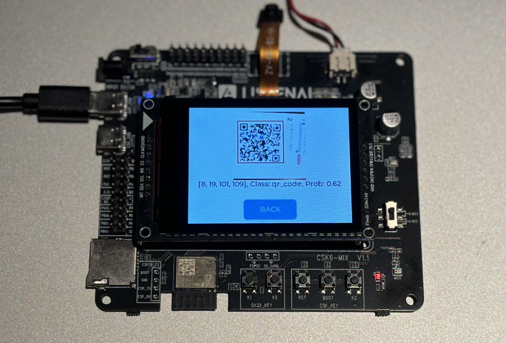

# YOLOv1-QRcode

QRcode detection project using LNN(linger&amp;thinker)  


## 介绍
本仓库利用LNN工具链实现二维码检测模型的落地。主要包括浮点训练、量化训练、模型打包、模拟引擎执行、固件烧录并芯片运行。其中固件烧录并芯片运行需要在聆思的开发板上来完成。

## 环境配置
### linger环境配置及安装
https://github.com/LISTENAI/linger/blob/main/doc/tutorial/install.md

### thinker环境配置及安装
https://github.com/LISTENAI/thinker/blob/main/thinker/docs/tutorial/install.md

## requirement


## 数据集
二维码数据下载链接：https://pan.baidu.com/s/1d66HKN-8773D2FmvyhMwFg


## 主要流程
### 模型训练
运行脚本train.py, 浮点训练(float)、约束训练(clamp)、量化训练(quant)会按顺序一次性执行  
最终该脚本会在./tmp.ignore/文件夹下生成一个YOLO.quant.onnx

### 模型打包
切换到thinker-env环境，使用thinker离线工具tpacker将刚才生成的onnx计算图打包
```
tpacker -g ./tmp.ignore/YOLO.quant.onnx -d True -o ./test_thinker/model.bin
```
### 推理执行
使用调用示例工程test_thinker，指定输入数据、资源文件和输出文件夹名称即可运行模拟代码。
```
chmod +x ./bin/test_thinker  
./bin/test_thinker ./demo/test_thinker/q_input.bin ./demo/test_thinker/model.bin output.bin 3 64 64 0
```

## 模型评估
float模式：
---class qr_code AP 0.9584357337014008---  
quant模式：
---class qr_code AP 0.9554898401324852---

## 模型部署
在CSK6多模态芯片上部署运行该算法模型：https://cloud.listenai.com/CSKG962172/duomotai_ap.git  


## 致谢
代码参考：
https://github.com/abeardear/pytorch-YOLO-v1/tree/master

